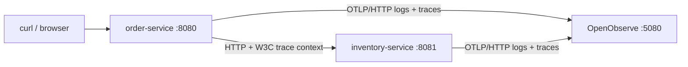
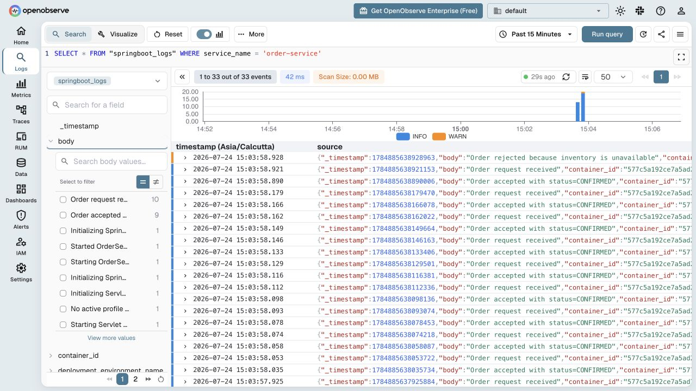
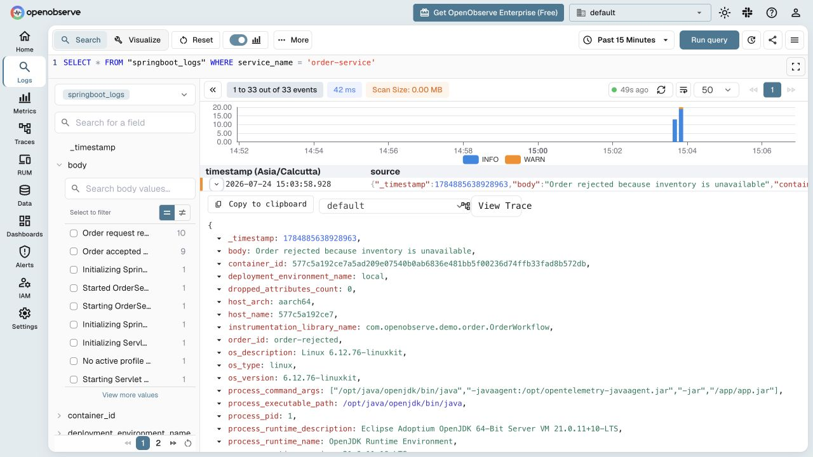
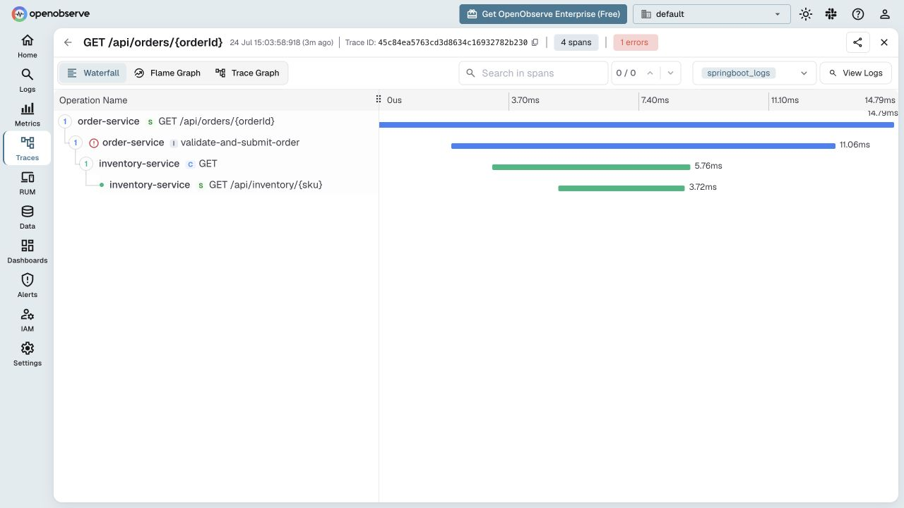
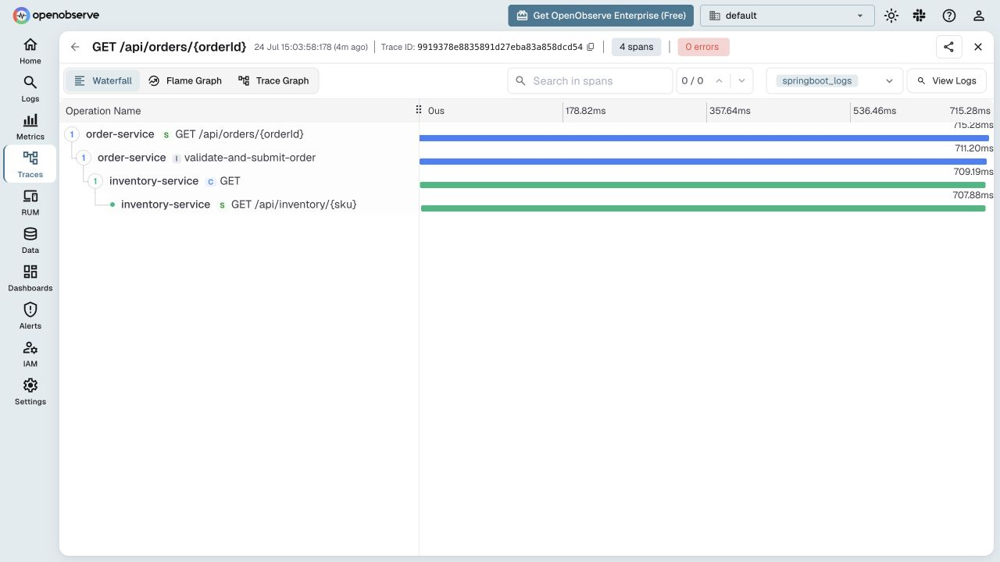
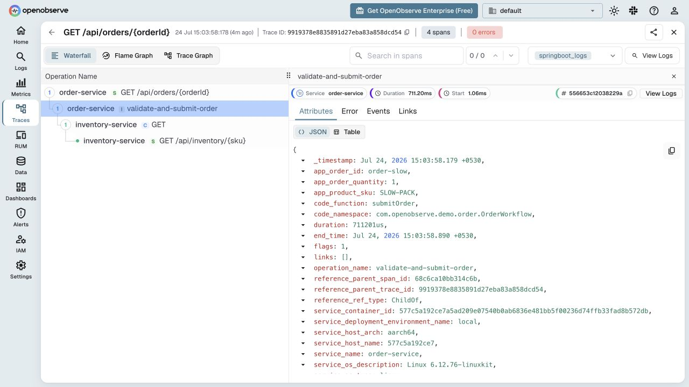

# Monitoring Spring Boot Applications: Logs and Distributed Traces with OpenObserve

Let's say a customer says, “Checkout is slow”, and your application says, “HTTP 500”.
Neither statement tells you which service failed, what that service was doing, or
which log messages belong to the same request.

In this blog, we will understand how to setup monitoring for Spring Boot applications and learn how to correlate logs and traces using OpenObserve.

## Why OpenObserve?

[OpenObserve](https://openobserve.ai/) is an open-source observability platform
that brings logs, metrics, traces, and real-user monitoring into one place. It
is OpenTelemetry-native and supports familiar SQL and PromQL queries, helping
teams investigate production behavior without stitching together separate
tools or learning a proprietary query language.


By the end, you will know how to integrate OpenObserve with a Spring Boot
application so you can:

- export structured logs and distributed traces through OpenTelemetry
- propagate one request across two Spring Boot services
- connect business fields, logs, and spans with `trace_id` and `span_id`
- use OpenObserve to investigate detailed telemetry data

## Watch the walkthrough

<a href="https://youtu.be/cVRdrHoPF0Q" target="_blank" rel="noopener noreferrer">
  
</a>


## Why application monitoring matters?

Modern applications are rarely one process on one machine. A single request
may cross an API gateway, several services, a database, a queue, and an external
API. That creates four recurring problems:

1. **Failures are partial.** A service can be healthy while one dependency,
   customer, region, or code path is failing.
2. **Latency is cumulative.** A 700 ms request does not reveal whether the time
   was spent in application code, the network, a database, or another service.
3. **Concurrency destroys narrative.** Logs from hundreds of requests are
   interleaved. A timestamp alone is not a reliable correlation key.
4. **Reproduction is expensive.** Production-only inputs, load, and timing
   frequently make a problem difficult to reproduce locally.

The primary goal of useful monitoring is to shorten the path from symptom to cause as much as possible.

## Prerequisites

Install:

- Docker Engine or Docker Desktop with Docker Compose v2;
- `bash`, `curl`, `openssl`, and `base64`;
- optionally Java 21 and Gradle 8.14+ to run tests outside Docker.

Confirm Docker is running:

```bash
docker version
docker compose version
```

## Step 1: Create safe local credentials

OpenObserve creates its root user on first startup. Do not commit that password
or its Base64 authorization token.

This sample's bootstrap script generates a local-only password and writes
`.env` with mode `0600`:

```bash
#!/usr/bin/env bash
set -euo pipefail

email="root@example.com"
password="Oo1!$(openssl rand -hex 18)"
auth_token="$(printf '%s:%s' "${email}" "${password}" | base64 | tr -d '\n')"

umask 077
{
  printf 'OPENOBSERVE_EMAIL=%s\n' "${email}"
  printf 'OPENOBSERVE_PASSWORD=%s\n' "${password}"
  printf 'OPENOBSERVE_AUTH_TOKEN=%s\n' "${auth_token}"
} > .env
```

Run the repository version, which refuses to overwrite an existing `.env`:

```bash
chmod +x scripts/*.sh
./scripts/bootstrap-env.sh
```

OpenObserve 0.91.3 requires 8-128
characters with at least one uppercase letter, lowercase letter, digit, and
special character. A long hexadecimal string alone is not accepted.

## Step 2: Run OpenObserve with Docker Compose

The complete `compose.yml` is in the sample. The OpenObserve service is:

```yaml
services:
  openobserve:
    image: public.ecr.aws/zinclabs/openobserve:v0.91.3
    environment:
      ZO_DATA_DIR: /data
      ZO_ROOT_USER_EMAIL: "${OPENOBSERVE_EMAIL:?Run ./scripts/bootstrap-env.sh first}"
      ZO_ROOT_USER_PASSWORD: "${OPENOBSERVE_PASSWORD:?Run ./scripts/bootstrap-env.sh first}"
    ports:
      - "5080:5080"
    volumes:
      - openobserve-data:/data
    restart: unless-stopped

volumes:
  openobserve-data:
```

`ZO_DATA_DIR` points OpenObserve at the named volume, so `docker compose down`
does not delete the stored data. This is a single-node developer setup, not an
HA production topology. The
[official self-hosted guide](https://openobserve.ai/docs/getting-started/)
also documents the root variables, `/data` volume, and port `5080`.

## Step 3: Configure OTLP logs and traces

Both application services inherit this environment block:

```yaml
x-otel-environment: &otel-environment
  OTEL_EXPORTER_OTLP_ENDPOINT: http://openobserve:5080/api/default
  OTEL_EXPORTER_OTLP_PROTOCOL: http/protobuf
  OTEL_EXPORTER_OTLP_HEADERS: "Authorization=Basic ${OPENOBSERVE_AUTH_TOKEN}"
  OTEL_EXPORTER_OTLP_LOGS_HEADERS: "Authorization=Basic ${OPENOBSERVE_AUTH_TOKEN},stream-name=springboot_logs"
  OTEL_TRACES_EXPORTER: otlp
  OTEL_LOGS_EXPORTER: otlp
  OTEL_METRICS_EXPORTER: none
  OTEL_TRACES_SAMPLER: always_on
  OTEL_INSTRUMENTATION_LOGBACK_APPENDER_EXPERIMENTAL_CAPTURE_MDC_ATTRIBUTES: "*"
  OTEL_BSP_SCHEDULE_DELAY: "1000"
  OTEL_BLRP_SCHEDULE_DELAY: "1000"
```
OpenObserve accepts OTLP logs at
`/api/{organization}/v1/logs` and traces at
`/api/{organization}/v1/traces`. Its
[OTLP log guide](https://openobserve.ai/docs/ingestion/logs/otlp/) documents
the Basic header and the no-trailing-slash requirement; the
[trace guide](https://openobserve.ai/docs/ingestion/traces/) documents the
trace endpoint.

Each service adds its identity:

```yaml
inventory-service:
  environment:
    <<: *otel-environment
    SERVER_PORT: "8081"
    OTEL_SERVICE_NAME: inventory-service
    OTEL_RESOURCE_ATTRIBUTES: deployment.environment.name=local,service.version=1.0.0

order-service:
  environment:
    <<: *otel-environment
    SERVER_PORT: "8080"
    INVENTORY_BASE_URL: http://inventory-service:8081
    OTEL_SERVICE_NAME: order-service
    OTEL_RESOURCE_ATTRIBUTES: deployment.environment.name=local,service.version=1.0.0
```

`OTEL_SERVICE_NAME` is especially important: it is how the trace waterfall and
the `service_name` search field distinguish the services.

## Step 4: Attach the OpenTelemetry Java agent

The application image downloads a pinned OpenTelemetry Java agent and verifies
its SHA-256 checksum during the build:

```dockerfile
FROM gradle:8.14.3-jdk21 AS build

ARG SERVICE
ARG OTEL_AGENT_VERSION=2.30.0
ARG OTEL_AGENT_SHA256=9d6bc2ad8dd8fb7f730984988e57b8ac0a82d81c7b3b8ae795378718733a509d

WORKDIR /workspace
COPY settings.gradle build.gradle ./
COPY inventory-service/build.gradle inventory-service/build.gradle
COPY order-service/build.gradle order-service/build.gradle
COPY inventory-service/src inventory-service/src
COPY order-service/src order-service/src

RUN gradle ":${SERVICE}:bootJar" --no-daemon \
    && curl -fsSL \
      "https://github.com/open-telemetry/opentelemetry-java-instrumentation/releases/download/v${OTEL_AGENT_VERSION}/opentelemetry-javaagent.jar" \
      -o /tmp/opentelemetry-javaagent.jar \
    && echo "${OTEL_AGENT_SHA256}  /tmp/opentelemetry-javaagent.jar" | sha256sum -c -

FROM eclipse-temurin:21-jre-jammy
ARG SERVICE

RUN groupadd --system app \
    && useradd --system --gid app --home-dir /app --create-home app

WORKDIR /app
COPY --from=build /tmp/opentelemetry-javaagent.jar /opt/opentelemetry-javaagent.jar
COPY --from=build "/workspace/${SERVICE}/build/libs/${SERVICE}.jar" /app/app.jar
USER app

ENTRYPOINT ["java", "-javaagent:/opt/opentelemetry-javaagent.jar", "-jar", "/app/app.jar"]
```

This gives us:

- Spring MVC server spans;
- Java `RestClient` client spans;
- W3C trace-context propagation between services;
- Logback-to-OpenTelemetry log capture;
- automatic `trace_id` and `span_id` correlation.

The runtime image uses a non-root user. Pinning and checksum verification also
make the build reproducible and reduce supply-chain ambiguity.

## Step 5: Add application logs with business context

The order workflow uses SLF4J/Logback normally. `MDC.putCloseable` scopes
business attributes to one request and reliably removes them afterward:

```java
@Service
public class OrderWorkflow {

    private static final Logger LOGGER =
            LoggerFactory.getLogger(OrderWorkflow.class);

    private final RestClient inventoryRestClient;

    OrderWorkflow(RestClient inventoryRestClient) {
        this.inventoryRestClient = inventoryRestClient;
    }

    @WithSpan("validate-and-submit-order")
    OrderResponse submitOrder(
            @SpanAttribute("app.order.id") String orderId,
            @SpanAttribute("app.product.sku") String sku,
            @SpanAttribute("app.order.quantity") int quantity) {
        try (var ignoredOrder = MDC.putCloseable("order_id", orderId);
                var ignoredSku = MDC.putCloseable("sku", sku);
                var ignoredQuantity =
                        MDC.putCloseable("quantity", Integer.toString(quantity))) {
            LOGGER.info("Order request received");

            InventoryResponse inventory = inventoryRestClient.get()
                    .uri("/api/inventory/{sku}", sku)
                    .retrieve()
                    .body(InventoryResponse.class);

            if (inventory == null
                    || !inventory.available()
                    || inventory.availableQuantity() < quantity) {
                LOGGER.warn("Order rejected because inventory is unavailable");
                throw new OutOfStockException(
                        "Not enough inventory for SKU " + sku);
            }

            LOGGER.info("Order accepted with status=CONFIRMED");
            return new OrderResponse(
                    orderId, sku, quantity, "CONFIRMED", "Inventory reserved");
        }
    }
}
```

The annotation dependency is:

```groovy
dependencies {
    implementation 'io.opentelemetry.instrumentation:opentelemetry-instrumentation-annotations:2.30.0'
}
```

`@WithSpan` creates a span around the method. `@SpanAttribute` adds the order
and product fields without a manual span lifecycle. If the method throws, the
agent records the exception and marks this span as an error.


## Step 6: Create a real cross-service trace

`order-service` builds a Spring `RestClient` for the second service:

```java
@Bean
RestClient inventoryRestClient(
        RestClient.Builder builder,
        @Value("${inventory.base-url}") String inventoryBaseUrl) {
    return builder.baseUrl(inventoryBaseUrl).build();
}
```

The Java agent instruments this client and injects a `traceparent` HTTP header.
The inventory service extracts that context automatically. The two services
therefore emit different spans with one shared trace ID.

The inventory endpoint provides deterministic demo behavior:

```java
@GetMapping("/{sku}")
InventoryResponse checkInventory(@PathVariable String sku)
        throws InterruptedException {
    try (var ignoredSku = MDC.putCloseable("sku", sku)) {
        if ("SLOW-PACK".equalsIgnoreCase(sku)) {
            LOGGER.info("Simulating a slow warehouse lookup");
            Thread.sleep(700);
        }

        int availableQuantity =
                "OUT-OF-STOCK".equalsIgnoreCase(sku) ? 0 : 25;
        boolean available = availableQuantity > 0;

        LOGGER.info(
                "Inventory lookup completed: available={}, available_quantity={}",
                available,
                availableQuantity);

        return new InventoryResponse(sku, available, availableQuantity);
    }
}
```
## How the Java code becomes telemetry
The application writes ordinary SLF4J logs and makes an ordinary Spring
`RestClient` call. The OpenTelemetry Java agent observes those supported
library boundaries, creates telemetry, and exports it asynchronously.

### 1. `javaagent` runs before Spring Boot

The container starts Java like this:

```text
java -javaagent:/opt/opentelemetry-javaagent.jar -jar /app/app.jar
```

`-javaagent` gives OpenTelemetry an instrumentation hook before application
classes are loaded. The agent installs bytecode instrumentation for supported
libraries, including Tomcat, Spring MVC, Spring `RestClient`, and Logback. It
also creates the OpenTelemetry SDK, propagators, span/log processors, and OTLP
exporters from the `OTEL_*` environment variables.

This is why the application does not need dependencies for the OpenTelemetry
SDK or OTLP exporter. The only OpenTelemetry application dependency is the
small annotations artifact used at compile time.

### 2. `@WithSpan` creates the business-operation span

The controller calls:

```java
orderWorkflow.submitOrder(orderId, sku, quantity);
```

The agent recognizes the annotation on the target method:

```java
@WithSpan("validate-and-submit-order")
OrderResponse submitOrder(
        @SpanAttribute("app.order.id") String orderId,
        @SpanAttribute("app.product.sku") String sku,
        @SpanAttribute("app.order.quantity") int quantity) {
    // ...
}
```

At normal return, the agent ends the span. If `OutOfStockException` leaves this
method, the annotation instrumentation records the exception and marks this
business span `ERROR` before `OrderController` catches the exception and maps
it to HTTP 409.

That explains the error screenshot: the business span is red while the
inventory HTTP span is green. Inventory responded successfully; the order was
rejected by domain logic.

The annotations artifact supplies only `@WithSpan` and `@SpanAttribute`.
Lifecycle management still belongs to the agent, so the code does not need
`Span.startSpan()`, `makeCurrent()`, `recordException()`, or `end()` calls.

### 3. MDC adds structured business fields to logs

The method opens three scoped MDC entries:

```java
try (var ignoredOrder = MDC.putCloseable("order_id", orderId);
        var ignoredSku = MDC.putCloseable("sku", sku);
        var ignoredQuantity =
                MDC.putCloseable("quantity", Integer.toString(quantity))) {
    LOGGER.info("Order request received");
    // ...
}
```

MDC is thread-local context owned by the logging framework. The
try-with-resources block is important because Tomcat reuses request threads.
Closing each entry prevents an order ID from leaking into a later request
handled by the same thread.

When this statement runs:

```java
LOGGER.warn("Order rejected because inventory is unavailable");
```

the collection path is:

1. SLF4J delegates to Logback.
2. Logback creates a `LoggingEvent` containing timestamp, level, logger name,
   message, and MDC map.
3. The agent's Logback appender instrumentation converts that event to an
   OpenTelemetry `LogRecord`.
4. The appender reads the current OpenTelemetry context and associates its
   trace ID and span ID with the record.
5. Because MDC capture is enabled with `*`, `order_id`, `sku`, and `quantity`
   become log attributes rather than text that must be parsed.
6. The batch log processor queues the record for OTLP export.

OpenObserve stores the result as fields similar to:

```json
{
  "body": "Order rejected because inventory is unavailable",
  "severity": "WARN",
  "service_name": "order-service",
  "order_id": "order-rejected",
  "sku": "OUT-OF-STOCK",
  "quantity": "1",
  "trace_id": "bbcbd24f612bf874d10b1abdeb818aa9",
  "span_id": "d0824deae6d175c2"
}
```

The agent's Logback MDC instrumentation exposes the active OpenTelemetry
context as MDC keys named `trace_id`, `span_id`, and `trace_flags`. That is why
the `%X{trace_id}` and `%X{span_id}` placeholders resolve during a request even
though the application never puts those particular keys into MDC itself.

### 4. `RestClient` creates and propagates the client span

This code contains no tracing calls:

```java
InventoryResponse inventory = inventoryRestClient.get()
        .uri("/api/inventory/{sku}", sku)
        .retrieve()
        .body(InventoryResponse.class);
```

The agent instruments the HTTP client used underneath `RestClient`. Before the
network call it:

1. creates a span with kind `CLIENT`, parented to
   `validate-and-submit-order`;
2. makes the client span current;
3. injects the current context into the outbound HTTP headers;
4. records the remote host, HTTP method, status, and duration;
5. ends the client span when the response or exception arrives.

## Step 7: Start and verify the stack

Build and start all three containers:

```bash
docker compose up --build -d
```

Check their status:

```bash
docker compose ps
```

Open <http://localhost:5080> and sign in as `root@example.com`. Retrieve the
generated password locally:

```bash
docker compose config | sed -n '/ZO_ROOT_USER_PASSWORD/p'
```

## Step 8: Generate useful telemetry

This traffic script creates multiple normal requests, one slow request, and one
expected failure:

```bash
./scripts/generate-traffic.sh 8
```

## Analyze logs in OpenObserve

1. Select **Logs** in the left navigation.
2. Select the `springboot_logs` stream.
3. Keep the time picker on **Past 15 Minutes**.
4. Enter this SQL query:

   ```sql
   SELECT *
   FROM "springboot_logs"
   WHERE service_name = 'order-service'
   ```

5. Select **Run query**.

OpenObserve shows a severity histogram, event count, scan size, available
fields, and the matching events:



Useful follow-up queries include:

```sql
-- Warnings and errors from the order service
SELECT *
FROM "springboot_logs"
WHERE service_name = 'order-service'
  AND severity IN ('WARN', 'ERROR')
```

```sql
-- Every log belonging to one request
SELECT *
FROM "springboot_logs"
WHERE trace_id = '<copy a trace_id from a result>'
```

```sql
-- Business events for the intentionally slow SKU
SELECT *
FROM "springboot_logs"
WHERE sku = 'SLOW-PACK'
```

Expanding the WARN event reveals `order_id`, `sku`, `severity`, `span_id`, and
`trace_id`. It also exposes **View Trace** because OpenObserve can correlate the
log fields:



In this version, `trace_id` and `span_id` were already the defaults under
**Settings → Organization Parameters → Log Details**. If your application uses
different names, set the mapping there. The
[OpenObserve trace documentation](https://openobserve.ai/docs/user-guide/data-exploration/traces/traces/)
describes this mapping and the bidirectional trace/log workflow.

## Analyze the rejected-order trace

Select **View Trace** on the WARN log. OpenObserve opens a four-span waterfall:



Read the waterfall from parent to child:

1. `GET /api/orders/{orderId}` is the 14.79 ms server span.
2. `validate-and-submit-order` is the explicit business span. It is marked as
   the one error and took 11.06 ms.
3. `GET` is the order service's 5.76 ms HTTP client span.
4. `GET /api/inventory/{sku}` is the inventory service's 3.72 ms server span.

The downstream service responded quickly and successfully. The business span,
not the inventory HTTP operation, is red. That distinction tells us this is an
expected domain rejection—not an inventory outage or a network failure.

The correlated WARN log adds the missing reason: inventory was unavailable for
`OUT-OF-STOCK`.

## Analyze the slow trace

In **Traces**, select the `default` trace stream. Useful filters are:

```text
service_name = "order-service"
duration >= "500ms"
```

Open the slow trace:



The root request took 715.28 ms. Its client span took 709.19 ms, and the
inventory server span took 707.88 ms. Most of the request time is therefore in
`inventory-service`, not in order validation or network overhead.

This is the core value of a distributed trace: it turns “the order endpoint is
slow” into “the inventory operation consumed roughly 99% of the request.”

Select the `validate-and-submit-order` span to inspect its attributes:



The span includes:

- `app_order_id=order-slow`;
- `app_order_quantity=1`;
- `app_product_sku=SLOW-PACK`;
- `code_namespace=com.openobserve.demo.order.OrderWorkflow`;
- `duration=711201us`;
- `service_name=order-service`.

These attributes lets you group latency by operation, product, or
service without parsing message text.

## Conclusion

The important outcome is not simply “logs and traces are being ingested.”
OpenObserve brings the signals together into a navigable investigation:

- a structured WARN log explains the business decision;
- `trace_id` connects that event to one request;
- the trace shows both Spring Boot services and their parent/child spans;
- the waterfall separates a fast domain rejection from a slow downstream call;
- custom span attributes preserve the business context needed to investigate.

OpenObserve lets you move from a symptom to the relevant log, correlated
trace, and span attributes in one place. The practical value of OpenObserve is
faster, evidence-based answers when your Spring Boot application is slow or
failing, or simply when you need high-performance, efficient observability at
production scale.
